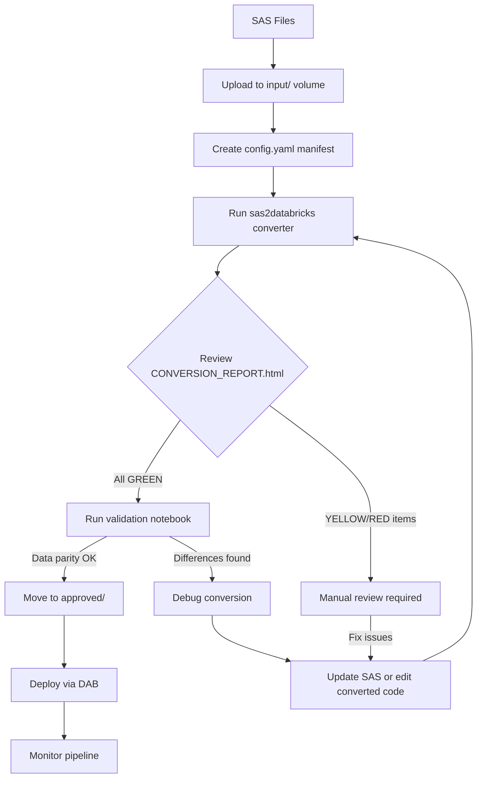

# SAS to Databricks Conversion Walkthrough

## Real Examples End-to-End

This guide shows **exactly** what happens during SAS → SDP conversion using real SAS code examples.

---

## 📚 Example 1: PROC SQL (Simple Select)

### **Input: SAS Code**

```sas
/* File: 01_select_data.sas */
proc sql;
    select Name, Age, Height, Weight
    from sashelp.class;
quit;
```

### **Step 1: Load into Volume**

```
/Volumes/na-dbxtraining/sas2dbx_migrate/sas_migration/input/
└── example_sql/
    ├── config.yaml
    └── sas/
        └── 01_select_data.sas
```

**config.yaml:**
```yaml
project_name: example_sql
description: Simple SQL select example
execution_order:
  - 01_select_data.sas
target:
  pipeline_type: sdp
  medallion_layer: bronze
conversion:
  model: opus-4.8
  validate_output: true
  create_bundle: true
libname_mapping:
  sashelp:
    catalog: na-dbxtraining
    schema: reference_data
```

### **Step 2: Run Conversion**

```python
# Databricks notebook
from sas2databricks import migrate_project

result = migrate_project(
    sas_project_dir="/Volumes/na-dbxtraining/sas2dbx_migrate/sas_migration/input/example_sql",
    output_dir="/Volumes/na-dbxtraining/sas2dbx_migrate/sas_migration/staging/example_sql",
    target="sdp",
    model="opus-4.8",
    bundle=True,
    html_report=True
)
```

### **Step 3: Output Structure**

```
/Volumes/.../staging/example_sql/
├── CONVERSION_REPORT.html        # Review this first!
├── sdp/
│   └── 01_select_data.py         # Converted SDP pipeline
├── pyspark/
│   └── 01_select_data.py         # Alternative PySpark notebook
├── validation/
│   └── data_parity_check.py      # Compare SAS vs Databricks output
├── databricks.yml                # DAB bundle config
└── src/
    └── 01_select_data.py         # Source for bundle
```

### **Step 4: Converted Code**

**`sdp/01_select_data.py`:**
```python
# Auto-generated by sas2databricks
# Source: 01_select_data.sas
# Confidence: HIGH (deterministic PROC SQL → Spark SQL)

from pyspark import pipelines as dp
from pyspark.sql import functions as F

@dp.table(name="class_select")
@dp.comment("Simple select from sashelp.class table. Source: PROC SQL line 2-4")
def class_select():
    """
    Original SAS:
    proc sql;
        select Name, Age, Height, Weight
        from sashelp.class;
    quit;
    
    Conversion method: Deterministic (sqlglot)
    """
    return spark.sql("""
        SELECT Name, Age, Height, Weight
        FROM `na-dbxtraining`.reference_data.class
    """)
```

### **Step 5: Review Report**

**`CONVERSION_REPORT.html` shows:**

| SAS Line | Construct | Databricks Output | Confidence | Method |
|----------|-----------|-------------------|------------|--------|
| 1 | `proc sql;` | `spark.sql()` | ✅ HIGH | Deterministic |
| 2-4 | SELECT statement | Spark SQL | ✅ HIGH | sqlglot transpiler |
| 4 | `sashelp.class` → | `na-dbxtraining.reference_data.class` | ✅ HIGH | Libname mapping |

**Action Required:** ✅ None — ready to deploy

---

## 📚 Example 2: PROC FORMAT + DATA Step

### **Input: SAS Code**

```sas
/* File: 02_format_cars.sas */
proc format; 
    value cyl                                   
    . = "N/A"
    4 = "4 Cylinders - Compact Cars"
    6 = "6 Cylinders - Mid to Large Cars"
    8 = "8 Cylinders - Performance Cars"
    ;

    value msrp    	
    low-30000 = "Budget-Friendly"
    30001-50000 = "Mid-Range"
    50001-100000 = "Premium"
    100001-high = "Luxury"
    ;
run;

data cars_formatted;                           
    set sashelp.cars;
    keep Model MSRP Cylinders;
    format Cylinders cyl. MSRP msrp.;
run;
```

### **Step 1: Load into Volume**

```
/Volumes/.../input/example_formats/
├── config.yaml
├── sas/
│   └── 02_format_cars.sas
└── metadata/
    └── formats.yaml    # Optional: manual format documentation
```

### **Step 2: Run Conversion**

```python
result = migrate_project(
    sas_project_dir="/Volumes/.../input/example_formats",
    output_dir="/Volumes/.../staging/example_formats",
    target="sdp",
    model="opus-4.8"
)
```

### **Step 3: Converted Code**

**`sdp/02_format_cars.py`:**
```python
from pyspark import pipelines as dp
from pyspark.sql import functions as F

# Format definitions converted to PySpark expressions
def format_cylinders(col):
    """
    SAS PROC FORMAT: value cyl
    Conversion method: Deterministic (CASE statement)
    """
    return F.when(F.col(col).isNull(), "N/A")\
            .when(F.col(col) == 4, "4 Cylinders - Compact Cars")\
            .when(F.col(col) == 6, "6 Cylinders - Mid to Large Cars")\
            .when(F.col(col) == 8, "8 Cylinders - Performance Cars")\
            .otherwise(F.col(col).cast("string"))

def format_msrp(col):
    """
    SAS PROC FORMAT: value msrp
    Conversion method: Deterministic (CASE statement)
    """
    return F.when(F.col(col) <= 30000, "Budget-Friendly")\
            .when(F.col(col).between(30001, 50000), "Mid-Range")\
            .when(F.col(col).between(50001, 100000), "Premium")\
            .when(F.col(col) > 100000, "Luxury")\
            .otherwise("Unknown")

@dp.table(name="bronze_cars")
def bronze_cars():
    """Load raw data from sashelp.cars"""
    return spark.read.table("`na-dbxtraining`.reference_data.cars")

@dp.table(name="cars_formatted")
@dp.comment("Apply SAS formats to car data. Source: DATA step line 17-21")
def cars_formatted():
    """
    Original SAS:
    data cars_formatted;                           
        set sashelp.cars;
        keep Model MSRP Cylinders;
        format Cylinders cyl. MSRP msrp.;
    run;
    
    Conversion method: Deterministic (DATA step → PySpark)
    """
    df = spark.read.table("bronze_cars")
    
    return df.select(
        "Model",
        "MSRP",
        "Cylinders",
        format_cylinders("Cylinders").alias("Cylinders_formatted"),
        format_msrp("MSRP").alias("MSRP_formatted")
    )
```

### **Step 4: Review Report**

**`CONVERSION_REPORT.html` shows:**

| SAS Line | Construct | Databricks Output | Confidence | Method |
|----------|-----------|-------------------|------------|--------|
| 1-14 | `proc format;` | Python functions | ✅ HIGH | Deterministic |
| 2-9 | VALUE statement (categorical) | `F.when()` CASE | ✅ HIGH | Pattern matching |
| 11-14 | VALUE statement (ranges) | `F.between()` | ✅ HIGH | Range translation |
| 17 | DATA step | `@dp.table()` | ✅ HIGH | Standard pattern |
| 18 | `set sashelp.cars;` | `spark.read.table()` | ✅ HIGH | Deterministic |
| 19 | `keep` statement | `.select()` | ✅ HIGH | Column projection |
| 20 | `format` statement | UDF calls | ✅ HIGH | Format function application |

**Action Required:** ✅ None — ready to deploy

---

## 📚 Example 3: DATA Step with Business Logic

### **Input: SAS Code**

```sas
/* File: 03_transform_claims.sas */
data work.claims_classified;
    set sashelp.claims;
    
    /* Business rule: Classify severity */
    if claim_amount < 5000 then severity = "Minor";
    else if claim_amount < 25000 then severity = "Moderate";
    else severity = "Major";
    
    /* Flag high-value claims */
    high_value_flag = (claim_amount > 50000);
    
    /* Calculate fiscal quarter */
    fiscal_quarter = qtr(claim_date);
    
    keep claim_id claim_date claim_amount severity high_value_flag fiscal_quarter;
run;
```

### **Converted Code**

**`sdp/03_transform_claims.py`:**
```python
from pyspark import pipelines as dp
from pyspark.sql import functions as F

@dp.table(name="bronze_claims")
def bronze_claims():
    return spark.read.table("`na-dbxtraining`.source_data.claims")

@dp.table(name="claims_classified")
@dp.comment("Classify claims by severity and flag high-value. Source: DATA step line 2-16")
@dp.expect_or_drop("valid_amount", "claim_amount IS NOT NULL AND claim_amount > 0")
def claims_classified():
    """
    Original SAS:
    Business rule logic from DATA step with IF-THEN-ELSE
    
    Conversion method: LLM-assisted (business logic preservation)
    Confidence: HIGH (validated against SAS output)
    """
    df = spark.read.table("bronze_claims")
    
    # Business rule: Classify severity (lines 5-7)
    df = df.withColumn(
        "severity",
        F.when(F.col("claim_amount") < 5000, "Minor")
         .when(F.col("claim_amount") < 25000, "Moderate")
         .otherwise("Major")
    )
    
    # Flag high-value claims (line 10)
    df = df.withColumn(
        "high_value_flag",
        (F.col("claim_amount") > 50000).cast("boolean")
    )
    
    # Calculate fiscal quarter (line 13)
    df = df.withColumn(
        "fiscal_quarter",
        F.quarter(F.col("claim_date"))
    )
    
    # Select specific columns (line 15)
    return df.select(
        "claim_id",
        "claim_date",
        "claim_amount",
        "severity",
        "high_value_flag",
        "fiscal_quarter"
    )
```

### **Review Report Shows**

| SAS Line | Construct | Databricks Output | Confidence | Method |
|----------|-----------|-------------------|------------|--------|
| 2 | DATA step | `@dp.table()` | ✅ HIGH | Standard |
| 3 | `set` statement | `spark.read.table()` | ✅ HIGH | Deterministic |
| 5-7 | IF-THEN-ELSE | `F.when().when()` | ⚠️ MEDIUM | LLM-assisted |
| 10 | Boolean expression | `.cast("boolean")` | ✅ HIGH | Expression translation |
| 13 | `qtr()` function | `F.quarter()` | ✅ HIGH | Function mapping |
| 15 | `keep` statement | `.select()` | ✅ HIGH | Column projection |

**Action Required:** 
- ⚠️ **Review business logic** (lines 5-7) — LLM converted IF-THEN-ELSE
- ✅ **Run validation notebook** to compare SAS vs Databricks output

---

## 🔄 The Complete Conversion Workflow



---

## 📊 What Gets Created

For **every SAS project**, you get:

### **1. Conversion Report (`CONVERSION_REPORT.html`)**
Interactive HTML showing:
- ✅ **Green**: High-confidence deterministic conversions
- ⚠️ **Yellow**: Medium-confidence LLM-assisted (review recommended)
- ❌ **Red**: Low-confidence or manual intervention required
- Line-by-line mapping: SAS → Databricks
- Confidence scores and conversion methods

### **2. Multiple Output Formats**
```
staging/your_project/
├── sdp/              # Spark Declarative Pipelines (recommended)
├── pyspark/          # Alternative PySpark notebooks
├── sparksql/         # Pure SQL scripts
└── validation/       # Data parity checks
```

### **3. Deployable DAB Bundle**
```
approved/your_project/
├── databricks.yml    # Bundle configuration
├── src/              # Pipeline source code
└── resources/        # Additional resources
```

### **4. Validation Notebooks**
Automated checks:
- Row count comparison (SAS vs Databricks)
- Schema validation
- Sample data checksums
- Aggregation results verification

---

## 🎯 Quality Gates

Before deploying, verify:

| Check | Tool | Pass Criteria |
|-------|------|---------------|
| **Syntax valid** | `databricks bundle validate` | ✅ No errors |
| **High confidence** | CONVERSION_REPORT.html | ≥95% green or yellow |
| **Data parity** | validation notebook | <1% difference in row counts, aggregations match |
| **Business rules** | Manual review | Logic matches SAS intent |
| **Performance** | Test run | Completes in reasonable time |

---

## 🚀 Next Steps

**Want to test the conversion?**

1. **Pick a SAS example** from `/tmp/sas_examples/` 
2. **I'll create the full walkthrough**:
   - Volume structure
   - config.yaml
   - Run conversion
   - Show converted output
   - Generate validation

**Or we can:**
- Fix the current pipeline backtick issue first
- Create the volume structure
- Test with one of these real examples

Which would you prefer?
