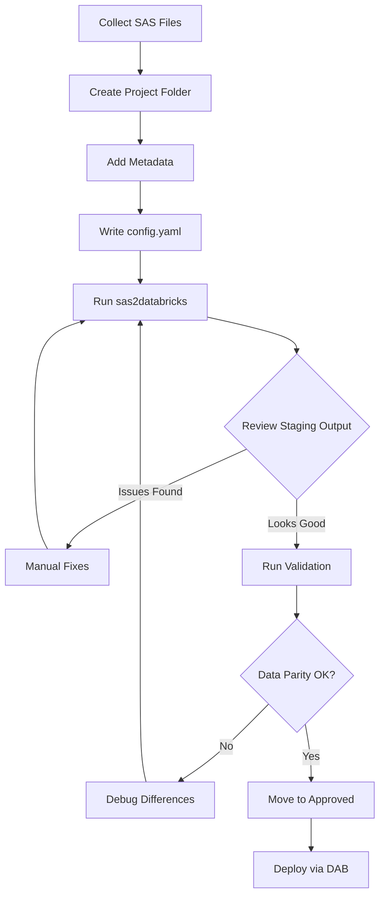

# SAS Migration Guide — Decomposition & Best Practices

## Overview

This guide explains how to decompose SAS processes into Databricks pipelines using the **sas2dbx-migrate** system.

---

## 📋 Table of Contents

1. [Data Dictionary Requirements](#1-data-dictionary-requirements)
2. [Input Organization Strategy](#2-input-organization-strategy)
3. [SAS Process Decomposition](#3-sas-process-decomposition)
4. [Conversion Workflow](#4-conversion-workflow)

---

## 1. Data Dictionary Requirements

### Why Data Dictionaries Matter

SAS programs rely on implicit metadata that must be made explicit for accurate Databricks migration:

| SAS Concept | What It Contains | Why We Need It |
|-------------|------------------|----------------|
| **PROC CONTENTS** | Table schemas (variable names, types, lengths) | Schema mapping to Delta tables |
| **Format Catalog** | Value mappings (1='Male', 2='Female') | UDF or mapping table generation |
| **Libname Definitions** | File paths → logical libraries | Unity Catalog schema mapping |
| **Variable Labels** | Business descriptions | Column comments in Delta tables |
| **Validation Rules** | WHERE clauses, DATA step IF logic | DLT expectations |

### What to Collect

#### A. Schema Metadata (PROC CONTENTS)

```sas
/* Export all table schemas from a library */
proc contents data=mylib._all_ 
    out=work.schema_dump(keep=memname name type length format label) 
    noprint;
run;

/* Export to CSV for processing */
proc export data=work.schema_dump
    outfile='/output/schemas.csv'
    dbms=csv replace;
run;
```

**Output format:**
```csv
MEMNAME,NAME,TYPE,LENGTH,FORMAT,LABEL
CLAIMS,CLAIM_ID,1,8,,$Claim Identifier
CLAIMS,CLAIM_DATE,1,8,DATE9.,Date Claim Filed
CLAIMS,AMOUNT,1,8,DOLLAR12.2,Claim Amount
```

#### B. Format Catalog

```sas
/* Export all formats from a catalog */
proc format library=mylib.formats cntlout=work.formats_dump;
run;

proc export data=work.formats_dump
    outfile='/output/formats.csv'
    dbms=csv replace;
run;
```

**Output format:**
```csv
FMTNAME,START,END,LABEL,TYPE
$GENDER,M,,Male,C
$GENDER,F,,Female,C
SEVERITY,1,,Minor,N
SEVERITY,2,,Moderate,N
SEVERITY,3,,Major,N
```

#### C. Libname Mapping

Create a mapping file from SAS libraries to Unity Catalog:

```yaml
# libname_mapping.yaml
libname_mappings:
  claims:
    sas_path: /sas/data/claims
    databricks_catalog: na-dbxtraining
    databricks_schema: claims_raw
    description: Raw claims data from legacy system
  
  refdata:
    sas_path: /sas/refdata
    databricks_catalog: na-dbxtraining
    databricks_schema: reference_data
    description: Lookup tables and reference data
  
  work:
    sas_path: WORK (temporary)
    databricks_catalog: na-dbxtraining
    databricks_schema: temp_workspace
    description: Intermediate working tables
```

#### D. Business Rules Documentation

Extract business logic from:
- SAS program comments
- DATA step IF-THEN logic
- Macro variable definitions
- PROC SQL WHERE clauses

**Example:**

```yaml
# business_rules.yaml
severity_classification:
  description: Claim severity based on dollar amount
  rules:
    - condition: amount < 5000
      severity: Minor
      severity_code: 1
    - condition: amount >= 5000 AND amount < 25000
      severity: Moderate
      severity_code: 2
    - condition: amount >= 25000
      severity: Major
      severity_code: 3

validation_rules:
  - name: valid_claim_id
    check: claim_id IS NOT NULL
    action: fail
  - name: positive_amount
    check: claim_amount > 0
    action: drop_row
```

### Storage Location

```
/Volumes/na-dbxtraining/sas2dbx_migrate/metadata_registry/
├── schemas/
│   ├── claims.csv           # PROC CONTENTS output
│   ├── policies.csv
│   └── appliances.csv
├── formats/
│   └── all_formats.csv      # Format catalog dump
├── libname_mapping.yaml     # SAS → Unity Catalog mapping
└── business_rules/
    ├── claims_rules.yaml
    └── risk_rules.yaml
```

---

## 2. Input Organization Strategy

### Folder Structure

```
/Volumes/na-dbxtraining/sas2dbx_migrate/input/
├── claims_analytics/              # Project folder (business domain)
│   ├── config.yaml                # ** PROJECT MANIFEST **
│   ├── sas/                       # SAS source files
│   │   ├── 01_load_claims.sas
│   │   ├── 02_enrich_claims.sas
│   │   ├── 03_weekly_summary.sas
│   │   └── macros/
│   │       └── severity_macro.sas
│   └── metadata/                  # Project-specific metadata
│       ├── proc_contents.csv
│       ├── formats.csv
│       └── dependencies.yaml
│
└── risk_models/
    ├── config.yaml
    ├── sas/
    └── metadata/
```

### Project Manifest (config.yaml)

**Required fields:**

```yaml
# config.yaml
project_name: claims_analytics
description: Weekly claims analytics and spike detection pipeline
sas_version: 9.4
owner: sarah.chen@example.com
created_date: 2026-09-16

# ** EXECUTION ORDER ** (critical for dependencies)
execution_order:
  - 01_load_claims.sas      # Bronze layer
  - 02_enrich_claims.sas    # Silver layer
  - 03_weekly_summary.sas   # Gold layer

# ** DEPENDENCIES ** (cross-project)
dependencies:
  - project: reference_data
    tables:
      - appliances
      - appliance_batches
  - project: policy_master
    tables:
      - policyholders

# ** TARGET CONFIGURATION **
target:
  pipeline_type: sdp             # sdp | pyspark | sparksql
  medallion_layer: end_to_end    # bronze | silver | gold | end_to_end
  schedule: "0 2 * * 1"          # Cron: Mondays at 2am
  compute: serverless            # serverless | classic

# ** LIBNAME MAPPING ** (SAS → Databricks)
libname_mapping:
  claims:
    catalog: na-dbxtraining
    schema: claims_raw
  refdata:
    catalog: na-dbxtraining
    schema: reference_data
  work:
    catalog: na-dbxtraining
    schema: temp_workspace

# ** CONVERSION SETTINGS **
conversion:
  model: opus-4.8              # opus-4.8 | codex | auto
  validate_output: true        # Generate validation notebooks
  create_bundle: true          # Create deployable DAB
  expectations:
    fail_on_error: false       # Drop bad rows vs fail pipeline
```

### When to Split Projects

**One project = one folder** when:
- ✅ Shares same execution schedule
- ✅ Produces related business output
- ✅ Can be tested/deployed as a unit

**Split into multiple projects** when:
- ❌ Different schedules (daily vs weekly)
- ❌ Different owners/teams
- ❌ Independent business domains
- ❌ Different SLA/criticality

**Example:**
```
✅ GOOD: claims_analytics/
  - All claims processing (load → enrich → report)
  - Weekly schedule
  - Same owner

❌ BAD: claims_and_risk_and_finance/
  - Mixed domains
  - Different schedules
  - Different owners
```

---

## 3. SAS Process Decomposition

### Step-by-Step Decomposition Strategy

#### **Step 1: Identify Program Boundaries**

Map each SAS program to a pipeline layer:

| SAS Pattern | Databricks Layer | Asset Type |
|-------------|------------------|------------|
| **INFILE, libname read** | Bronze | SDP table (raw copy) |
| **DATA step joins/transforms** | Silver | SDP table (business logic) |
| **PROC SQL aggregations** | Gold | SDP table or Metric View |
| **PROC MEANS/FREQ** | Gold | Metric View or gold table |
| **PROC REPORT/TABULATE** | Consumption | AI/BI Dashboard query |
| **%MACRO definitions** | Config | Pipeline parameters |

#### **Step 2: Extract Data Lineage**

Use this template:

```yaml
# dependencies.yaml (auto-generated or manual)
program: 01_load_claims.sas
inputs:
  - source: /sas/data/raw/claims.csv
    type: external_file
outputs:
  - table: work.raw_claims
    type: temp_table
dependencies: []

---

program: 02_enrich_claims.sas
inputs:
  - table: work.raw_claims
    type: temp_table
  - table: refdata.policyholders
    type: lookup
outputs:
  - table: work.enriched_claims
    type: temp_table
dependencies:
  - 01_load_claims.sas

---

program: 03_weekly_summary.sas
inputs:
  - table: work.enriched_claims
    type: temp_table
outputs:
  - table: output.weekly_summary
    type: final
dependencies:
  - 02_enrich_claims.sas
```

#### **Step 3: Decompose Monolithic Programs**

**Bad (SAS monolith):**
```sas
/* claims_weekly_report.sas - 800 lines */
libname claims '/data/claims';
libname refdata '/refdata';

/* Load data */
data work.raw_claims;
    set claims.claims_2026;
run;

/* Join with policies */
proc sql;
    create table work.enriched as
    select a.*, b.policy_type
    from work.raw_claims a
    left join refdata.policies b
    on a.policy_id = b.policy_id;
quit;

/* Calculate aggregations */
proc means data=work.enriched noprint;
    class week;
    var claim_amount;
    output out=work.weekly_summary sum=weekly_claims;
run;

/* Generate report */
proc report data=work.weekly_summary;
    column week weekly_claims;
run;
```

**Good (Decomposed to SDP):**

```python
# src/claims_pipeline.py - Modern Spark Declarative Pipelines
from pyspark import pipelines as dp

# Bronze layer
@dp.table(name="bronze_claims")
def bronze_claims():
    return spark.read.table("`na-dbxtraining`.claims_raw.claims_2026")

# Silver layer
@dp.table(name="silver_claims_enriched")
def silver_claims_enriched():
    claims = spark.read.table("bronze_claims")
    policies = spark.read.table("`na-dbxtraining`.reference_data.policies")
    return claims.join(policies, "policy_id", "left")

# Gold layer
@dp.table(name="gold_weekly_summary")
def gold_weekly_summary():
    return spark.sql("""
        SELECT week, SUM(claim_amount) as weekly_claims
        FROM silver_claims_enriched
        GROUP BY week
    """)
```

#### **Step 4: Handle Macros**

**SAS Macro:**
```sas
%macro classify_severity(amount);
    %if &amount < 5000 %then %do;
        severity = "Minor";
    %end;
    %else %if &amount < 25000 %then %do;
        severity = "Moderate";
    %end;
    %else %do;
        severity = "Major";
    %end;
%mend;

data work.classified;
    set work.claims;
    %classify_severity(claim_amount);
run;
```

**Databricks Equivalent (Option 1: PySpark UDF):**
```python
from pyspark.sql import functions as F

def classify_severity(amount):
    if amount < 5000:
        return "Minor"
    elif amount < 25000:
        return "Moderate"
    else:
        return "Major"

classify_udf = F.udf(classify_severity)

df = df.withColumn("severity", classify_udf(F.col("claim_amount")))
```

**Databricks Equivalent (Option 2: SQL CASE):**
```python
df = df.selectExpr("*", """
    CASE 
        WHEN claim_amount < 5000 THEN 'Minor'
        WHEN claim_amount < 25000 THEN 'Moderate'
        ELSE 'Major'
    END as severity
""")
```

---

## 4. Conversion Workflow

### End-to-End Process



### Detailed Steps

#### **1. Preparation**

```bash
# Create project folder
mkdir -p /Volumes/.../input/claims_analytics/{sas,metadata}

# Copy SAS files
cp *.sas /Volumes/.../input/claims_analytics/sas/

# Generate metadata
# (run PROC CONTENTS, PROC FORMAT in SAS, export to CSV)

# Create config.yaml
# (use template from section 2)
```

#### **2. Conversion**

```python
# Databricks notebook: run_conversion.py
from sas2databricks import migrate_project

result = migrate_project(
    sas_project_dir="/Volumes/.../input/claims_analytics",
    output_dir="/Volumes/.../staging/claims_analytics",
    target="sdp",  # Modern Spark Declarative Pipelines
    model="opus-4.8",
    bundle=True,
    html_report=True
)

print(f"Conversion complete: {result}")
```

#### **3. Review**

Open `/Volumes/.../staging/claims_analytics/CONVERSION_REPORT.html`:

- ✅ **High confidence** (green) — Deterministic conversion
- ⚠️ **Medium confidence** (yellow) — LLM-assisted, review recommended
- ❌ **Low confidence** (red) — Manual review required

#### **4. Validation**

```python
# Auto-generated validation notebook
# staging/claims_analytics/validation/data_parity_check.py

# Compares:
# - Row counts
# - Schema differences
# - Sample data checksums
# - Aggregation results
```

#### **5. Approval & Deploy**

```bash
# Move to approved folder
mv /Volumes/.../staging/claims_analytics /Volumes/.../approved/

# Deploy via DAB
cd /Volumes/.../approved/claims_analytics
databricks bundle validate -t dev
databricks bundle deploy -t dev
databricks bundle run claims_analytics_pipeline -t dev
```

---

## 📊 Quick Reference

### SAS → Databricks Mapping

| SAS Construct | Databricks Equivalent |
|---------------|----------------------|
| `libname claims '/data';` | `catalog.schema` |
| `data work.tmp; set claims.raw; run;` | `@dp.table` + `spark.read.table` |
| `proc sql; create table ... select ...; quit;` | `@dp.table` + `spark.sql` |
| `proc means; class by_var; var amount; run;` | `groupBy(...).agg(...)` |
| `%let var = value;` | Pipeline configuration parameter |
| `%macro name(...); ... %mend;` | Python function or UDF |
| `where condition;` | `@dp.expect_or_drop` (SDP expectation) |
| `proc format; value $gender 'M'='Male'; run;` | UDF or mapping table |

**Note:** SDP (Spark Declarative Pipelines) is the modern name for Delta Live Tables (DLT). All code uses the modern `from pyspark import pipelines as dp` API.

---

## 🎯 Success Criteria

Before deploying a converted project, verify:

- ✅ All SAS programs mapped to Databricks assets
- ✅ Data lineage matches (inputs → transformations → outputs)
- ✅ Validation notebooks show <1% data parity difference
- ✅ CONVERSION_REPORT.html has no red (low confidence) items
- ✅ config.yaml execution_order matches SAS dependencies
- ✅ All macros converted to functions or config parameters
- ✅ Format catalogs converted to UDFs or lookup tables
- ✅ Pipeline runs successfully in dev environment

---

**Next:** See `/specifications/VOLUME_SETUP.md` for creating the volume structure.
